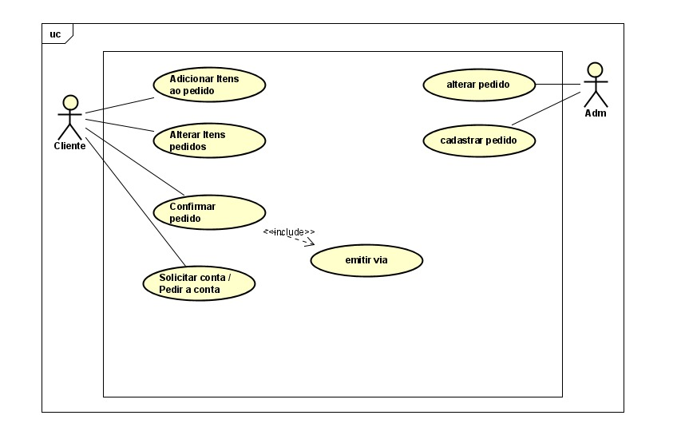

# Diagrama de Caso de Uso

## Atores
- **Cliente**: Usuário que realiza pedidos.
- **Administrador (Adm)**: Responsável pela gestão dos pedidos.

## Casos de Uso
### Cliente
- **Adicionar Itens ao Pedido**: Cliente pode incluir novos itens ao pedido.
- **Alterar Itens Pedidos**: Cliente pode modificar os itens antes da confirmação.
- **Confirmar Pedido**: Finaliza o pedido com os itens escolhidos.
- **Solicitar Conta / Pedir a Conta**: Solicita o fechamento da conta.
- **Emitir Via** *(include)*: Gera uma via do pedido.

### Administrador (Adm)
- **Alterar Pedido**: Modifica um pedido registrado.
- **Cadastrar Pedido**: Registra novos pedidos no sistema.

---

# Caso de Uso Descritivo

## Caso de Uso: Adicionar Itens ao Pedido
**Ator Primário:** Cliente  
**Descrição:** Permite que o cliente adicione itens ao seu pedido.  
**Fluxo Principal:**  
1. O cliente acessa o sistema de pedidos.
2. Seleciona os itens desejados no menu.
3. Adiciona os itens ao carrinho.
4. O sistema confirma a adição e exibe o pedido atualizado.

**Fluxo Alternativo:**  
- Se um item não estiver disponível, o sistema exibe uma mensagem de indisponibilidade.

---

## Caso de Uso: Alterar Itens Pedidos
**Ator Primário:** Cliente  
**Descrição:** Permite que o cliente modifique itens antes da confirmação do pedido.  
**Fluxo Principal:**  
1. O cliente acessa o pedido em andamento.
2. Modifica os itens (adiciona/remova conforme necessário).
3. O sistema atualiza o pedido e exibe a nova lista de itens.

**Fluxo Alternativo:**  
- Se o cliente tentar modificar um pedido já confirmado, o sistema nega a alteração.

---

## Caso de Uso: Confirmar Pedido
**Ator Primário:** Cliente  
**Descrição:** Finaliza o pedido com os itens escolhidos.  
**Fluxo Principal:**  
1. O cliente revisa os itens do pedido.
2. Confirma a finalização do pedido.
3. O sistema registra o pedido e o encaminha para preparo.

**Fluxo Alternativo:**  
- Se houver falha no registro, o sistema exibe um aviso e solicita nova tentativa.

---

## Caso de Uso: Solicitar Conta / Pedir a Conta
**Ator Primário:** Cliente  
**Descrição:** Permite que o cliente solicite a conta para pagamento.  
**Fluxo Principal:**  
1. O cliente acessa a opção de solicitar a conta.
2. O sistema processa a solicitação.
3. O atendente recebe a solicitação e entrega a conta.

**Fluxo Alternativo:**  
- Se houver erro na solicitação, o sistema exibe um aviso ao cliente.

---

## Caso de Uso: Emitir Via
**Ator Primário:** Sistema  
**Descrição:** Gera uma via do pedido para referência.  
**Fluxo Principal:**  
1. O cliente solicita uma via do pedido.
2. O sistema gera a via e disponibiliza a visualização ou impressão.

**Fluxo Alternativo:**  
- Se houver erro na geração da via, o sistema informa o cliente.

---

## Caso de Uso: Alterar Pedido (Administrador)
**Ator Primário:** Administrador  
**Descrição:** Permite que o administrador modifique um pedido já registrado.  
**Fluxo Principal:**  
1. O administrador acessa a lista de pedidos.
2. Seleciona o pedido a ser alterado.
3. Modifica os itens ou valores.
4. O sistema confirma a alteração e atualiza o pedido.

**Fluxo Alternativo:**  
- Se o pedido já foi finalizado, o sistema nega a alteração.

---

## Caso de Uso: Cadastrar Pedido (Administrador)
**Ator Primário:** Administrador  
**Descrição:** Permite que o administrador registre novos pedidos no sistema.  
**Fluxo Principal:**  
1. O administrador acessa o sistema de pedidos.
2. Insere os dados do novo pedido.
3. Confirma o cadastro.
4. O sistema armazena e exibe o pedido registrado.

**Fluxo Alternativo:**  
- Se houver erro no cadastro, o sistema solicita correção dos dados.

---
