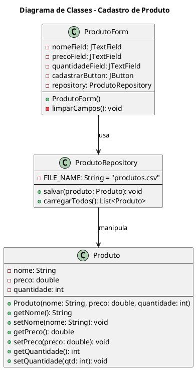

```plantuml
@startuml
title Diagrama de Sequência - Cadastro de Produto

actor Usuario

boundary ProdutoForm
control ProdutoRepository
entity Produto

== Início do Cadastro ==

Usuario -> ProdutoForm : preencherCampos()
Usuario -> ProdutoForm : clicarEmCadastrar()

ProdutoForm -> Produto : new Produto(nome, preco, quantidade)

ProdutoForm -> ProdutoRepository : salvar(produto)

ProdutoRepository -> "Arquivo CSV" : escreverLinha(produto)

ProdutoRepository --> ProdutoForm : retorno (void)

ProdutoForm -> Usuario : mostrarMensagem("Produto cadastrado com sucesso!")

@enduml
```

# Cadastro de Produto com Interface Gráfica (Java + CSV)

Este projeto é um exemplo didático utilizado na disciplina de **Projeto de Software**, com o objetivo de demonstrar a interação entre o **Diagrama de Classes** e o **Diagrama de Sequência**.

A funcionalidade implementada é o **Cadastro de Produtos**, onde os dados são inseridos por meio de uma **interface gráfica (Swing)** e armazenados em um arquivo **CSV**.

---

## ✨ Funcionalidade Principal

- Cadastro de produto com os campos:
  - Nome
  - Preço
  - Quantidade
  - Categoria
- Armazenamento dos dados em arquivo CSV
- Interface simples com Java Swing

---

## 🧱 Estrutura do Projeto

- `Produto`: classe modelo que representa o produto
- `ProdutoDAO`: responsável por salvar e carregar os dados do arquivo CSV
- `ProdutoForm`: interface gráfica para entrada dos dados

---

## 📘 Diagrama de Classes

<!-- Substitua o link abaixo com a imagem do seu diagrama de classes -->
### Astah


---

### PlantUML


---

#### PlantUML – code



---

## 🔄 Diagrama de Sequência

<!-- Substitua o link abaixo com a imagem do seu diagrama de sequência -->
### Astah


---

### PlantUML


---

#### PlantUML – code



---

## ▶️ Como Executar

1. Clone este repositório:
   ```bash
   git clone https://github.com/seu-usuario/cadastro-produto-java.git
   ```
2. Compile os arquivos `.java`:
   ```bash
   javac *.java
   ```
3. Execute a interface gráfica:
   ```bash
   java ProdutoForm
   ```

---

## 🧠 Objetivos Didáticos

- Compreender o uso prático de diagramas UML (classes e sequência)
- Aplicar a arquitetura orientada a objetos
- Trabalhar com persistência de dados simples (CSV)
- Desenvolver interfaces gráficas com Swing

---

## 📂 Organização dos Arquivos

```
CadastroProdutoCSV/
├── Projeto/
│   ├── src/
│   │   └── main/
│   │       └── java/
│   │           └── com/
│   │               └── mycompany/
│   │                   └── cadastroproduto/
│   │                       ├── Produto.java
│   │                       ├── ProdutoForm.java
│   │                       └── ProdutoRepository.java
│   └── produtos.csv
├── LICENSE
└── README.md
```

---

### 🗂️ Descrição dos Diretórios e Arquivos

- **`Produto.java`**: Classe que representa o modelo de dados.
- **`ProdutoForm.java`**: Interface gráfica (Swing) para entrada de dados.
- **`ProdutoRepository.java`**: Responsável por salvar e carregar produtos do arquivo CSV.
- **`produtos.csv`**: Arquivo onde os dados são persistidos.
- **`LICENSE`**: Arquivo de licença MIT.
- **`README.md`**: Este arquivo com instruções e explicações do projeto.

---

## 🧩 Desafio

Como exercício complementar, **projete e implemente as demais funcionalidades do CRUD (Create, Read, Update, Delete)** para produtos:

- 📖 **Listar Produtos**: Leia e exiba todos os produtos cadastrados no CSV.
- ✏️ **Atualizar Produto**: Permita alterar as informações de um produto existente.
- ❌ **Excluir Produto**: Implemente uma forma de apagar um produto do CSV.

> 💡 Lembre-se de adaptar o repositório e a interface gráfica para essas operações, sempre mantendo a separação entre lógica de apresentação e acesso a dados.

---


## 📄 Licença

Este projeto está licenciado sob os termos da licença MIT.  
Consulte o arquivo [LICENSE](LICENSE) para mais informações.

---
---

## 👤 Autor

**Prof. Herysson R. Figueredo**  
Curso de Ciência da Computação – Universidade Franciscana (UFN)

📧 E-mail: herysson.figueiredo@ufn.edu.br  
🔗 GitHub: [@Herysson](https://github.com/Herysson)  
