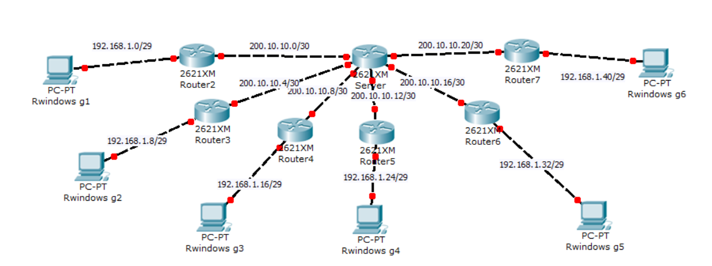
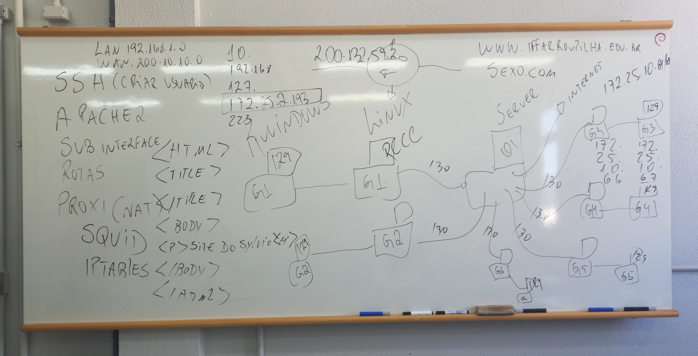

# TRABALHO REDES

### Sumário
1. [Integrantes do Grupo](#integrantes-do-grupo)
2. [Passo a Passo](#passo-a-passo)
   - [Planejar as Redes](#planejar-as-redes)
   - [Utilizar o Linux](#utilizar-o-linux)
   - [Instalar o SSH no Linux](#instalar-o-ssh-no-linux)
   - [Instalar o Apache 2 no Linux](#instalar-o-apache-2-no-linux)
   - [Criar Sub-interfaces](#criar-sub-interfaces)
   - [Configurar Rotas](#configurar-rotas)
   - [Bloquear Sites com Proxy](#bloquear-sites-com-proxy)
3. [FAZER](#fazer)
4. [Informações Gerais](#informações-gerais)
5. [Redes](#redes)
6. [Quadro](#quadro)
7. [Sites Relevantes](#sites-relevantes)

### Integrantes do Grupo
- **Grupo 1:** Yuri Alexander, Eduardo Cerreta e Meani 
- **Grupo 2:** Pedro, Miguel e Machado

> **Nota:** Todas as instruções a seguir devem ser executadas no terminal do Linux.

> **Ferramentas:** SSH, Linux, Windows, Apache 2, rotas, Sub-interface e Proxy(SQUID e IP TABLES)

---

## Passo a passo
1. **Planejar as redes**
   - Definir a topologia de rede, incluindo dispositivos e conexões.
   - **LAN:** 192.168.1.0/24
   - **WAN:** 200.10.10.0/24

2. **Utilizar o Linux**
   - Utilizar todas as ferramentas necessárias no Linux.

3. **Instalar o SSH no Linux**
   - Para instalação, siga as orientações abaixo:
     ```bash
     sudo apt-get update
     sudo apt-get upgrade
     sudo apt-get install openssh-client
     ```

   - Criar usuário:
     ```bash
     sudo adduser username
     ```

   - Adicionar usuário na lista do SUDO:
     ```bash
     sudo usermod -aG sudo username
     ```

   - Entra como super usuário:
     ```bash
     sudo su
     ```

   - Logar usuário / Mudar usuário:
     ```bash
     sudo su username
     ```

4. **Instalar o Apache 2 no Linux**
   - Para instalação, siga as orientações abaixo:
     ```bash
     sudo apt update
     sudo apt install apache2
     ```

   - Inicie o serviço:
     ```bash
     sudo systemctl start apache2
     ```

   - Criando a página:
     ```bash
     sudo nano /var/www/html/grupo1.html
     ```

   - A página:
     ```html
     <!DOCTYPE html>
     <html lang="pt-BR">
     <head>
         <meta charset="UTF-8">
         <meta name="viewport" content="width=device-width, initial-scale=1.0">
         <title>Página do Grupo 1</title>
     </head>
     <body>
         <h1>Bem-vindo à nossa página, professor!</h1>
         <p>Esta é uma página criada com Apache2.</p>
     </body>
     </html>
     ```

   - Para salvar e sair da "criação html":
     ```bash
     Ctrl + X
     ou
     Y + Enter
     ```

   - Configurando permissões:
     ```bash
     sudo chown -R www-data:www-data /var/www/html/
     sudo chmod -R 755 /var/www/html/
     ```

   - (Opcional) Habilitar no firewall:
     ```bash
     sudo ufw allow 'Apache'
     ```

   - Abrir Site criado: http://172.25.2.204/grupo1.html

5. **Criar Sub-interfaces no Linux**
   - Primeiramente tem que instalar o net-tools
     ```bash
     sudo apt install net-tools
     ```

   - Mostra roteador
     ```bash
     sudo ifconfig
     ```

   - Adiciona a sub-interface (O IP será diferente conforme o grupo)
     ```bash
     sudo ifconfig enp0s31f6:0 192.168.1.9 netmask 255.255.255.248
     ```

6. **Configurar Rotas**
   - Exibir rotas
     ```bash
     sudo route
     ```
7. **Bloquear sites com Proxy**
   - **Baixar o SQUID:**
     ```bash
     sudo apt-get install squid
     ```

   - **Verificar a Instalação**
     ```bash
     sudo service squid status
     ```

   - **Configurar o SQUID**
     ```bash
     cd /etc/squid
     ```

   - **Fazer Backup do SQUID**
     ```bash
     sudo cp squid.conf squid.conf.backup
     ```

   - **Apagar o SQUID e Criar Novo**
     ```bash
     sudo rm squid.conf
     sudo nano squid.conf
     ```

---

### Andamento
| Nome          | Concluído                                               | Para que serve                          |
|---------------|:-------------------------------------------------------:|-----------------------------------------|
| LINUX         |   ✅                                                     | Ambiente para execução das tarefas      |
| SSH           |   ✅                                                     | Acesso remoto e seguro ao servidor      |
| APACHE 2      |   ✅                                                     | Servidor web para hospedar páginas      |
| SUB-INTERFACE |   ✅                                                     | Segmentação de rede para diferentes serviços |
| ROTAS         |   ❌                                                     | Direcionamento de tráfego na rede       |
| Proxy         |   ❌                                                     | Intermediário para requisições externas |
| SQUID       |    ✅                                                 | Servidor proxy para controle de acesso  |
| IP TABLES   |   ❌                                                     | Gerenciamento de regras de firewall     |
---


### Informações para lembrar 
Endereços que começam com 172 são endereços inválidos que não navegam pela internet.
Linux: quando criar sub-interface não vai permitir. IPV4 alterar 0 para 1.

- **Endereço IPv4:** 172.25.2.205
- **Máscara de Sub-rede:** 255.255.255.192
- **Gateway Padrão:** 172.25.2.193

---

<h2 align="center">Redes</h2>
<p align="center">
    
</p>

<h2 align="center">Quadro</h2>
<p align="center">
    
</p>

---

<h2 align="center">Sites Relevantes</h2>

<div align="center">

| Nome     | Link                                               |
|----------|----------------------------------------------------|
| **Dontpad** | [dontpad.com/grupodosfalhosprogramadores](https://dontpad.com/grupodosfalhosprogramadores) |
| **Bloquear** | [pedr0xh.free.nf](http://172.25.2.204/grupo1.html)                         |
| **Grupo 1** | [http://172.25.2.204/grupo1.html](http://172.25.2.204/grupo1.html) |

</div>
