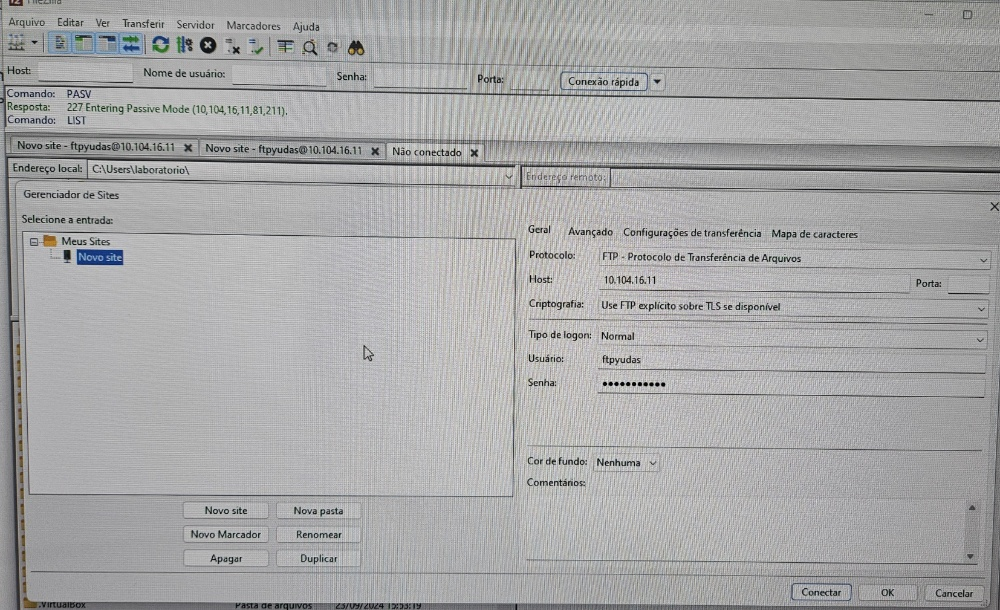
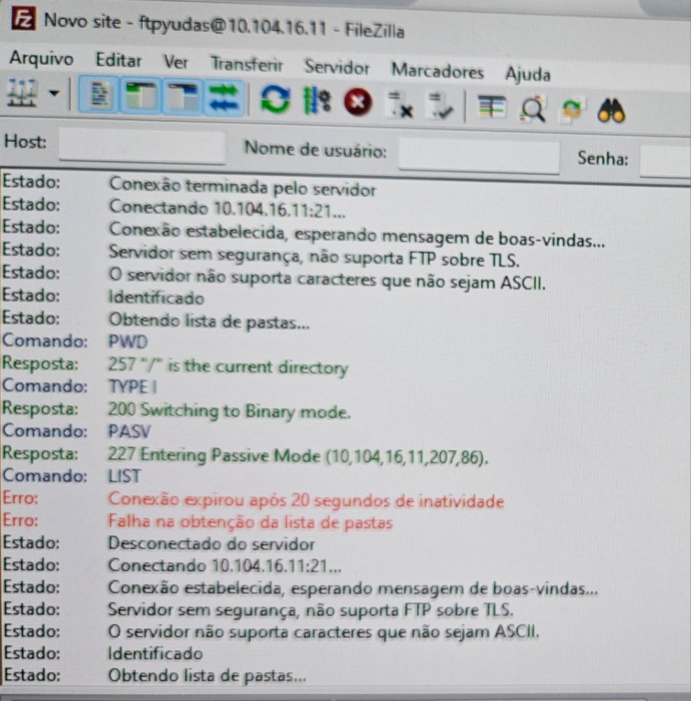
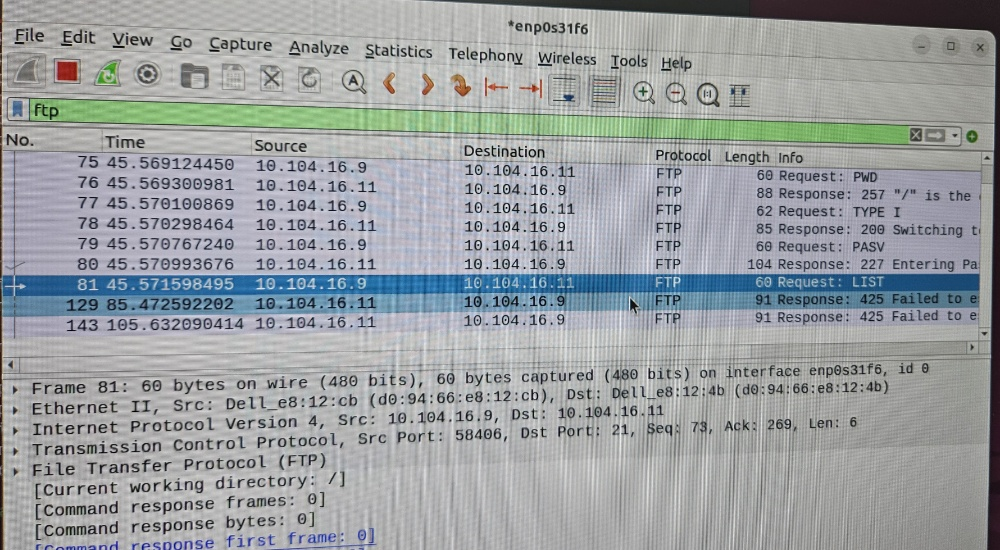
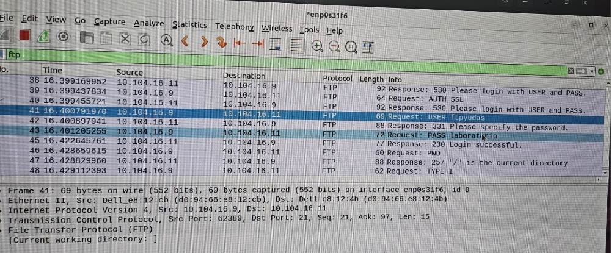
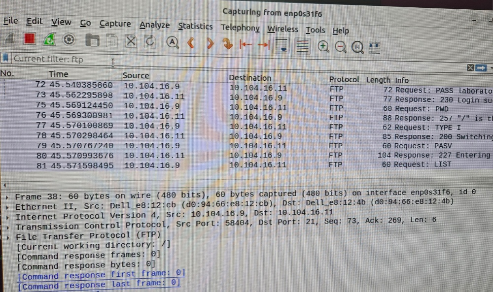
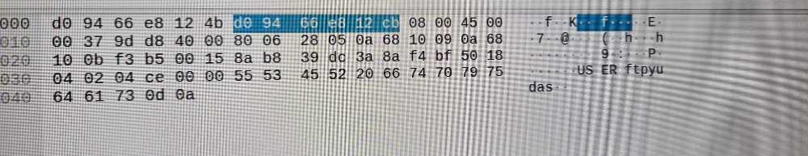
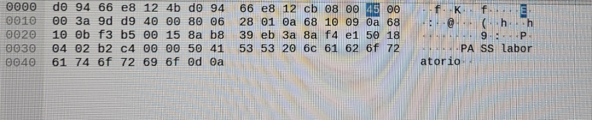

# Projeto: Captura de Credenciais FTP com Wireshark

Este repositório documenta um exercício prático de análise de rede, demonstrando a vulnerabilidade inerente ao protocolo FTP (File Transfer Protocol) através da captura de credenciais de login em texto plano utilizando o Wireshark.

## Arquitetura do Ambiente

O laboratório foi configurado com uma arquitetura cliente-servidor, consistindo em:

* **Servidor:** Uma máquina com **Ubuntu**, responsável por hospedar o serviço FTP (`vsftpd`) e realizar a captura de pacotes com o `Wireshark`.
* **Cliente:** Uma máquina com **Windows**, utilizando o `FileZilla Client` para se conectar ao servidor FTP.

## Ferramentas Utilizadas

* **Analisador de Protocolo:** Wireshark
* **Servidor FTP:** `vsftpd` (no Ubuntu)
* **Cliente FTP:** `FileZilla` (no Windows)
* **Firewall:** `UFW` (Uncomplicated Firewall no Ubuntu)

## Passo a Passo da Execução

O processo foi dividido em configuração, diagnóstico de problemas, aplicação da correção e análise final dos resultados.

### 1. Configuração do Servidor Ubuntu

Primeiramente, o ambiente do servidor no Ubuntu foi preparado com os seguintes comandos:

```bash
# Atualiza a lista de pacotes
sudo apt update

# Instala o servidor FTP e o Wireshark
sudo apt install vsftpd wireshark

# Configura as permissões para o Wireshark
sudo dpkg-reconfigure wireshark-common # (Selecionar <Sim>)
sudo usermod -aG wireshark $USER # (Requer logout/login para aplicar)

# Configura o Firewall para a conexão FTP
sudo ufw allow 20/tcp
sudo ufw allow 21/tcp
sudo ufw enable

# Verifica o status do firewall e da rede
sudo ufw status
hostname -I

# Comandos de gerenciamento do serviço FTP
sudo systemctl status vsftpd
sudo systemctl restart vsftpd
```

### 2. Configuração do Cliente FileZilla

No Windows, o FileZilla foi configurado através do "Gerenciador de Sites" para salvar as informações de conexão com o servidor.



### 3. Diagnóstico do Problema de Conexão (Modo Passivo)

A primeira tentativa de conexão falhou. O log do FileZilla mostrou um erro de tempo limite ao tentar obter a lista de pastas, um problema clássico de Modo Passivo do FTP quando o firewall bloqueia as portas de dados.



A captura do Wireshark no servidor confirmou o problema, mostrando que o comando `LIST` falhou.



### 4. Aplicação da Correção no Servidor

Para resolver o problema do Modo Passivo, o servidor `vsftpd` foi configurado para usar um intervalo de portas específico (40000-41000), e este intervalo foi liberado no firewall do Ubuntu.


```bash
# Adicionar ao final do arquivo /etc/vsftpd.conf
# pasv_min_port=40000
# pasv_max_port=41000

# Liberar o intervalo de portas no firewall
sudo ufw allow 40000:41000/tcp

# Reiniciar o serviço para aplicar as mudanças
sudo systemctl restart vsftpd
```

### 6. Análise da Captura no Wireshark

Com a conexão bem-sucedida, a captura no Wireshark foi interrompida e filtrada pelo protocolo `ftp`. A análise revelou claramente os pacotes contendo os comandos `USER` e `PASS` enviados do cliente para o servidor.



A senha é visível em texto plano diretamente na lista de pacotes.



### 7. Evidência das Credenciais Capturadas

Uma análise mais profunda nos detalhes dos pacotes confirmou a transmissão das credenciais em texto claro.

**Evidência do Usuário (`ftpyudas`):**
O conteúdo do pacote revela o nome de usuário enviado sem qualquer criptografia.



**Evidência da Senha (`laboratorio`):**
Da mesma forma, o pacote de senha mostra os dados de forma completamente legível.



## Conclusão

Este exercício demonstrou com sucesso a vulnerabilidade fundamental do protocolo FTP padrão. As credenciais de autenticação são transmitidas abertamente pela rede, tornando qualquer usuário suscetível à interceptação de dados. Fica evidente a necessidade crítica de se utilizar protocolos seguros como **SFTP (SSH File Transfer Protocol)** ou **FTPS (FTP over SSL/TLS)** em qualquer ambiente que exija a transferência segura de arquivos.
