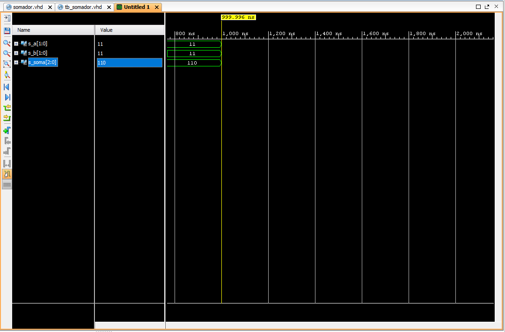
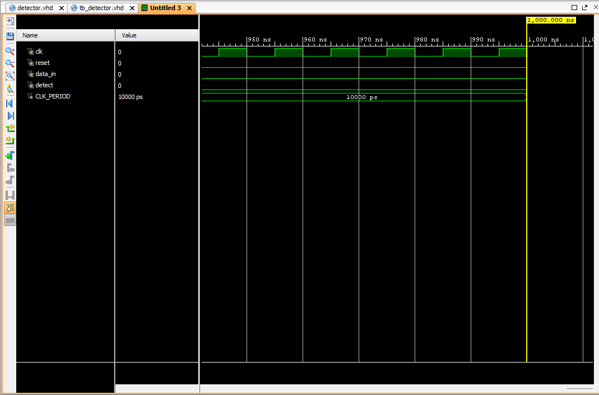
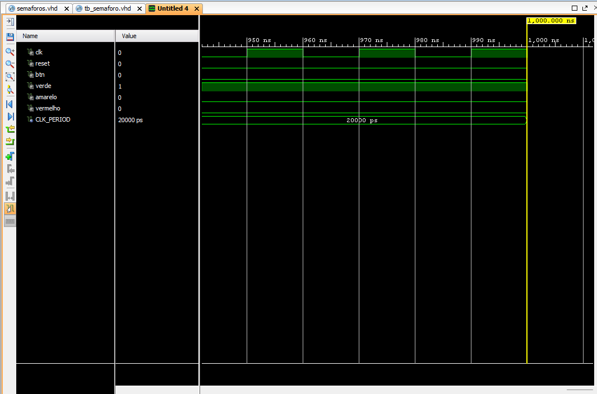

<div align="center">

# Meus Projetos de VHDL - Implementação e Verificação

</div>

Este repositório contém uma coleção de projetos em VHDL desenvolvidos para praticar conceitos de sistemas digitais. O foco abrange desde circuitos combinacionais básicos até Máquinas de Estados Finitos (FSMs) mais complexas. Cada projeto inclui o código-fonte do design, um testbench para verificação funcional e os resultados da simulação.

## Projetos

1.  [Somador de 2 Bits](#1-somador-de-2-bits)
2.  [Detector de Sequência "11010"](#2-detector-de-sequência-11010)
3.  [Semáforo com Botão de Pedestre](#3-semáforo-com-botão-de-pedestre)

<div align="center">

# Projeto 1: Somador de 2 Bits

</div>

## 1. Somador de 2 Bits

Implementação de um circuito combinacional que soma dois números de 2 bits (`a` e `b`), gerando um resultado de 3 bits (`soma`) para acomodar o bit de carry.

#### Resultados da Simulação

*Figura 1: Simulação mostrando a varredura de todas as 16 combinações de entrada e o resultado da soma correspondente.*

#### Código Fonte

**Design (somador.vhd):**
```vhdl
library IEEE;
use IEEE.STD_LOGIC_1164.ALL;
use IEEE.NUMERIC_STD.ALL;

entity somador is
    Port ( 
        a    : in  STD_LOGIC_VECTOR(1 downto 0);
        b    : in  STD_LOGIC_VECTOR(1 downto 0);
        soma : out STD_LOGIC_VECTOR(2 downto 0)
    );
end somador;

architecture Behavioral of somador is
begin
    soma <= std_logic_vector(unsigned('0' & a) + unsigned('0' & b));
end Behavioral;
```
**TestBench (tb_somador.vhd):**
```vhdl
library IEEE;
use IEEE.STD_LOGIC_1164.ALL;
use IEEE.NUMERIC_STD.ALL;

entity tb_somador is
end tb_somador;

architecture Behavioral of tb_somador is

    component somador
        Port ( 
            a    : in  STD_LOGIC_VECTOR(1 downto 0);
            b    : in  STD_LOGIC_VECTOR(1 downto 0);
            soma : out STD_LOGIC_VECTOR(2 downto 0)
        );
    end component;

    signal s_a    : STD_LOGIC_VECTOR(1 downto 0) := "00";
    signal s_b    : STD_LOGIC_VECTOR(1 downto 0) := "00";
    signal s_soma : STD_LOGIC_VECTOR(2 downto 0);

begin

    uut: somador
        port map (
            a    => s_a,
            b    => s_b,
            soma => s_soma
        );

    stim_proc: process
    begin
        for i in 0 to 3 loop
            for j in 0 to 3 loop
                s_a <= std_logic_vector(to_unsigned(i, 2));
                s_b <= std_logic_vector(to_unsigned(j, 2));
                wait for 10 ns;
            end loop;
        end loop;
        wait;
    end process;

end Behavioral;
```
---
<div align="center">

# Projeto 2: Detector de Sequência "11010"

</div>

## 2. Detector de Sequência (FSM 5 bits)

Projeto de uma FSM do tipo Moore que detecta a sequência “11010” em um fluxo serial de bits.
- A saída ‘detect’ deve ser ativada em ‘1’ apenas no ciclo em que a sequência completa for reconhecida.
- Após a detecção, a FSM deve voltar ao estado inicial, aguardando novamente os 5 bits completos (sem sobreposição).

#### Diagrama de Estados (Texto Simples)
```
(S_IDLE) --'1'--> (S_1)
(S_IDLE) --'0'--> (S_IDLE)

(S_1) --'1'--> (S_11)
(S_1) --'0'--> (S_IDLE)

(S_11) --'0'--> (S_110)
(S_11) --'1'--> (S_11)

(S_110) --'1'--> (S_1101)
(S_110) --'0'--> (S_IDLE)

(S_1101) --'0'--> (S_DETECT) [Saída detect = '1']
(S_1101) --'1'--> (S_1)

(S_DETECT) --'qualquer'--> (S_IDLE)
```

#### Resultados da Simulação

*Figura 2: Simulação validando a detecção da sequência correta e o comportamento da FSM em casos de falha.*

#### Código Fonte

**Design (detector.vhd):**
```vhdl
library IEEE;
use IEEE.STD_LOGIC_1164.ALL;

entity detector is
    Port (
        clk      : in  STD_LOGIC;
        reset    : in  STD_LOGIC;
        data_in  : in  STD_LOGIC;
        detect   : out STD_LOGIC
    );
end detector;

architecture Behavioral of detector is

    type state_type is (S_IDLE, S_1, S_11, S_110, S_1101, S_DETECT);
    signal current_state, next_state : state_type;

begin

    process(clk, reset)
    begin
        if reset = '1' then
            current_state <= S_IDLE;
        elsif rising_edge(clk) then
            current_state <= next_state;
        end if;
    end process;

    process(current_state, data_in)
    begin
        if current_state = S_DETECT then
            detect <= '1';
        else
            detect <= '0';
        end if;

        case current_state is
            when S_IDLE =>
                if data_in = '1' then
                    next_state <= S_1;
                else
                    next_state <= S_IDLE;
                end if;
            when S_1 =>
                if data_in = '1' then
                    next_state <= S_11;
                else
                    next_state <= S_IDLE;
                end if;
            when S_11 =>
                if data_in = '0' then
                    next_state <= S_110;
                else
                    next_state <= S_11;
                end if;
            when S_110 =>
                if data_in = '1' then
                    next_state <= S_1101;
                else
                    next_state <= S_IDLE;
                end if;
            when S_1101 =>
                if data_in = '0' then
                    next_state <= S_DETECT;
                else
                    next_state <= S_1;
                end if;
            when S_DETECT =>
                next_state <= S_IDLE;
        end case;
    end process;

end Behavioral;
```

**TestBench (tb_detector.vhd):**
```vhdl
library IEEE;
use IEEE.STD_LOGIC_1164.ALL;

entity tb_detector is
end tb_detector;

architecture Behavioral of tb_detector is

    component detector
        Port (
            clk      : in  STD_LOGIC;
            reset    : in  STD_LOGIC;
            data_in  : in  STD_LOGIC;
            detect   : out STD_LOGIC
        );
    end component;

    signal clk      : STD_LOGIC := '0';
    signal reset    : STD_LOGIC;
    signal data_in  : STD_LOGIC;
    signal detect   : STD_LOGIC;

    constant CLK_PERIOD : time := 10 ns;

begin

    uut: detector
        port map (
            clk      => clk,
            reset    => reset,
            data_in  => data_in,
            detect   => detect
        );

    clk_process : process
    begin
        clk <= '0';
        wait for CLK_PERIOD / 2;
        clk <= '1';
        wait for CLK_PERIOD / 2;
    end process;

    stimulus_process : process
    begin
        reset <= '1';
        data_in <= '0';
        wait for 2 * CLK_PERIOD;
        reset <= '0';
        wait for CLK_PERIOD;

        -- Teste com a sequência CORRETA "11010"
        data_in <= '1'; wait for CLK_PERIOD;
        data_in <= '1'; wait for CLK_PERIOD;
        data_in <= '0'; wait for CLK_PERIOD;
        data_in <= '1'; wait for CLK_PERIOD;
        data_in <= '0'; wait for CLK_PERIOD;
        wait for 2 * CLK_PERIOD;

        -- Teste com bits incorretos no meio
        data_in <= '1'; wait for CLK_PERIOD;
        data_in <= '1'; wait for CLK_PERIOD;
        data_in <= '0'; wait for CLK_PERIOD;
        data_in <= '0'; wait for CLK_PERIOD;
        wait for 2 * CLK_PERIOD;

        -- Teste com sequência correta após uma falha
        data_in <= '1'; wait for CLK_PERIOD; 
        data_in <= '0'; wait for CLK_PERIOD;
        data_in <= '1'; wait for CLK_PERIOD;
        data_in <= '1'; wait for CLK_PERIOD;
        data_in <= '0'; wait for CLK_PERIOD;
        data_in <= '1'; wait for CLK_PERIOD;
        data_in <= '0'; wait for CLK_PERIOD;
        wait for 2 * CLK_PERIOD;
        
        wait;

    end process;

end Behavioral;
```
---

<div align="center">

# Projeto 3: Semáforo com Botão de Pedestre

</div>

## 3. Semáforo com Botão de Pedestre

Implemente uma FSM Moore que controla um semáforo de 3 luzes (verde, amarelo, vermelho) com um botão de pedestre (btn). Sem o botão, o ciclo segue normalmente (Verde → Amarelo → Vermelho → Verde). Se btn=1, deve completar o verde atual, seguir para Amarelo → Vermelho, manter o vermelho por 2 tempos e então voltar para Verde.

#### Diagrama de Estados (Texto Simples)
```
(S_VERDE) --fim do timer--> (S_AMARELO)
  * Se btn='1', registra o pedido do pedestre.

(S_AMARELO) --fim do timer E pedido='0'--> (S_VERMELHO)
(S_AMARELO) --fim do timer E pedido='1'--> (S_VERMELHO_PED)

(S_VERMELHO) --fim do timer--> (S_VERDE)

(S_VERMELHO_PED) --fim do timer estendido--> (S_VERDE)
  * Zera o pedido do pedestre.
```

#### Tabela de Transições

| Estado Atual     | Condição                     | Próximo Estado   | Ação a ser Registrada     |
| :--------------- | :--------------------------- | :--------------- | :------------------------ |
| `S_VERDE`        | Fim do timer                 | `S_AMARELO`      | Se `btn='1'`, `ped_request<='1'` |
| `S_AMARELO`      | Fim do timer E `ped_request='0'` | `S_VERMELHO`     | -                         |
| `S_AMARELO`      | Fim do timer E `ped_request='1'` | `S_VERMELHO_PED` | -                         |
| `S_VERMELHO`     | Fim do timer                 | `S_VERDE`        | -                         |
| `S_VERMELHO_PED` | Fim do timer estendido       | `S_VERDE`        | `ped_request<='0'`           |


#### Resultados da Simulação

*Figura 3: Simulação mostrando o ciclo normal e o ciclo modificado após o acionamento do botão de pedestre (`btn`).*

#### Código Fonte

**Design (semaforos.vhd):**

```vhdl
library IEEE;
use IEEE.STD_LOGIC_1164.ALL;
use IEEE.NUMERIC_STD.ALL;

entity semaforos is
    Port (
        clk      : in  STD_LOGIC;
        reset    : in  STD_LOGIC;
        btn      : in  STD_LOGIC;
        verde    : out STD_LOGIC;
        amarelo  : out STD_LOGIC;
        vermelho : out STD_LOGIC
    );
end semaforos;

architecture Behavioral of semaforos is

    constant CLK_FREQ           : integer := 50_000_000;
    constant TEMPO_VERDE        : integer := 5;
    constant TEMPO_AMARELO      : integer := 2;
    constant TEMPO_VERMELHO     : integer := 5;
    constant TEMPO_VERMELHO_PED : integer := TEMPO_VERMELHO * 2;

    type state_type is (S_VERDE, S_AMARELO, S_VERMELHO, S_VERMELHO_PED);
    
    signal current_state : state_type;
    signal timer_count   : integer range 0 to CLK_FREQ * TEMPO_VERMELHO_PED;
    signal ped_request   : std_logic := '0';

begin

    process(clk, reset)
    begin
        if reset = '1' then
            current_state <= S_VERDE;
            timer_count   <= 0;
            ped_request   <= '0';
        elsif rising_edge(clk) then
            case current_state is
                when S_VERDE =>
                    if btn = '1' then
                        ped_request <= '1';
                    end if;
                    if timer_count = (CLK_FREQ * TEMPO_VERDE) - 1 then
                        current_state <= S_AMARELO;
                        timer_count   <= 0;
                    else
                        timer_count <= timer_count + 1;
                    end if;

                when S_AMARELO =>
                    if timer_count = (CLK_FREQ * TEMPO_AMARELO) - 1 then
                        if ped_request = '1' then
                            current_state <= S_VERMELHO_PED;
                        else
                            current_state <= S_VERMELHO;
                        end if;
                        timer_count <= 0;
                    else
                        timer_count <= timer_count + 1;
                    end if;

                when S_VERMELHO =>
                    if timer_count = (CLK_FREQ * TEMPO_VERMELHO) - 1 then
                        current_state <= S_VERDE;
                        timer_count   <= 0;
                    else
                        timer_count <= timer_count + 1;
                    end if;

                when S_VERMELHO_PED =>
                    if timer_count = (CLK_FREQ * TEMPO_VERMELHO_PED) - 1 then
                        current_state <= S_VERDE;
                        timer_count   <= 0;
                        ped_request   <= '0';
                    else
                        timer_count <= timer_count + 1;
                    end if;
            end case;
        end if;
    end process;

    process(current_state)
    begin
        case current_state is
            when S_VERDE =>
                verde    <= '1';
                amarelo  <= '0';
                vermelho <= '0';
            when S_AMARELO =>
                verde    <= '0';
                amarelo  <= '1';
                vermelho <= '0';
            when S_VERMELHO | S_VERMELHO_PED =>
                verde    <= '0';
                amarelo  <= '0';
                vermelho <= '1';
        end case;
    end process;

end Behavioral;
```

**TestBench (tb_semaforo.vhd):**

```vhdl
library IEEE;
use IEEE.STD_LOGIC_1164.ALL;

entity tb_semaforo is
end tb_semaforo;

architecture Behavioral of tb_semaforo is

    component semaforos
        Port (
            clk      : in  STD_LOGIC;
            reset    : in  STD_LOGIC;
            btn      : in  STD_LOGIC;
            verde    : out STD_LOGIC;
            amarelo  : out STD_LOGIC;
            vermelho : out STD_LOGIC
        );
    end component;

    signal clk      : STD_LOGIC := '0';
    signal reset    : STD_LOGIC;
    signal btn      : STD_LOGIC;
    signal verde    : STD_LOGIC;
    signal amarelo  : STD_LOGIC;
    signal vermelho : STD_LOGIC;
    
    constant CLK_PERIOD : time := 20 ns;

begin

    uut: semaforos
        port map (
            clk      => clk,
            reset    => reset,
            btn      => btn,
            verde    => verde,
            amarelo  => amarelo,
            vermelho => vermelho
        );

    clk_process : process
    begin
        clk <= '0'; wait for CLK_PERIOD / 2;
        clk <= '1'; wait for CLK_PERIOD / 2;
    end process;

    stimulus_process : process
    begin
        reset <= '1';
        btn   <= '0';
        wait for 100 ns;
        reset <= '0';
        wait for CLK_PERIOD;

        wait for 15 sec;

        wait for 2 sec;
        
        btn <= '1';
        wait for CLK_PERIOD;
        btn <= '0';

        wait for 20 sec;

        wait;
    end process;

end Behavioral;
```eof

```

