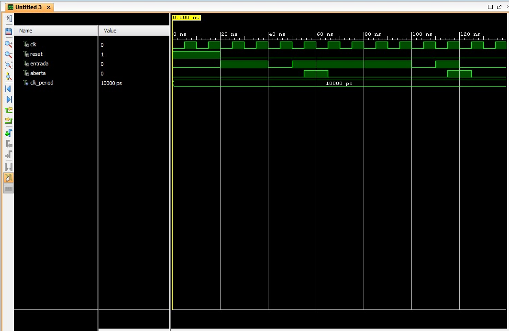
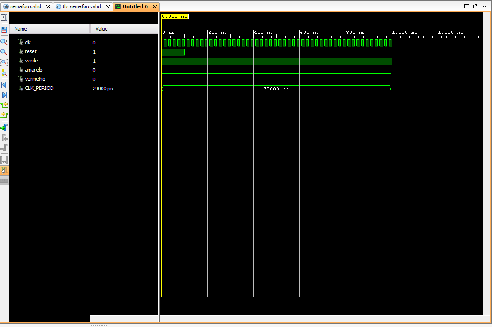
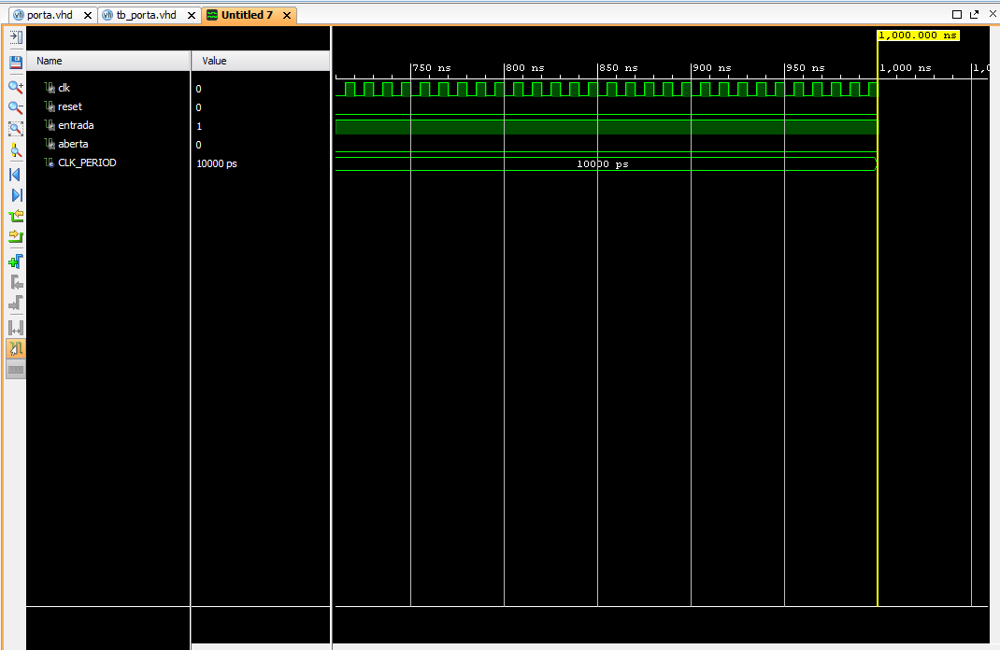
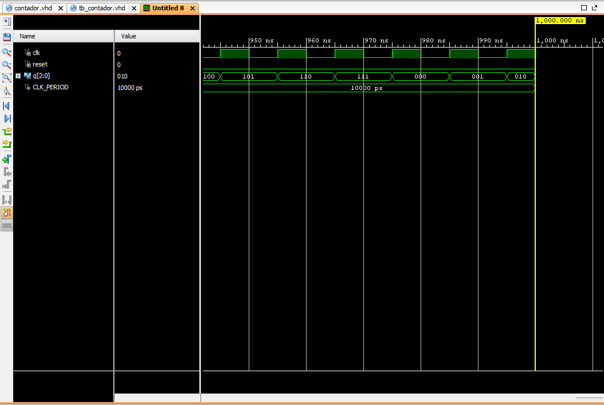
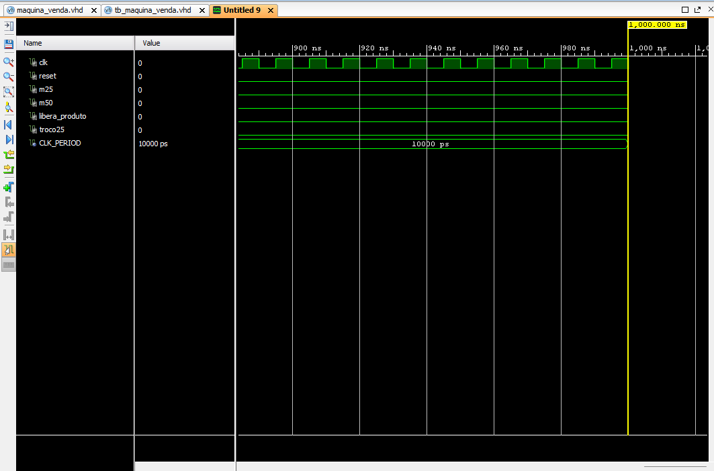

<div align="center">

# Meus Projetos de VHDL - Sistemas Digitais

</div>

Este repositório contém uma coleção de projetos básicos em VHDL desenvolvidos para a disciplina de Sistemas Digitais, com foco na implementação de Máquinas de Estados Finitos (FSMs). Cada projeto inclui o código-fonte do design, um testbench para simulação e os resultados da simulação.

## Projetos

1.  [Detector de Sequência "101"](#1-detector-de-sequência-101)
2.  [Semáforo com Temporizador](#2-semáforo-com-temporizador)
3.  [Porta com Senha "1101"](#3-porta-com-senha-1101)
4.  [Contador de 3 Bits via FSM](#4-contador-de-3-bits-via-fsm)
5.  [Máquina de Venda Automática](#5-máquina-de-venda-automática)

---

## 1. Detector de Sequência "101"

Este projeto implementa uma FSM do tipo Moore que detecta a sequência de bits `101` em uma entrada serial.

#### Resultados da Simulação

*Figura 1: Simulação do detector '101' mostrando a saída ativada após a sequência correta.*

#### Código Fonte
<details>
<summary>Clique para ver o código do Design (detector_101.vhd)</summary>

```vhdl
-- Código do detector_101.vhd
library IEEE;
use IEEE.STD_LOGIC_1164.ALL;

entity detector_101 is
    Port (
        clk     : in  STD_LOGIC;
        reset   : in  STD_LOGIC;
        entrada : in  STD_LOGIC;
        saida   : out STD_LOGIC
    );
end detector_101;

architecture Behavioral of detector_101 is
    type state_type is (S0, S1, S2, S3);
    signal estado, prox_estado : state_type;
begin
    process(clk, reset)
    begin
        if reset = '1' then
            estado <= S0;
        elsif rising_edge(clk) then
            estado <= prox_estado;
        end if;
    end process;

    process(estado, entrada)
    begin
        saida <= '0';
        prox_estado <= S0;
        case estado is
            when S0 =>
                if entrada = '1' then prox_estado <= S1;
                else prox_estado <= S0; end if;
            when S1 =>
                if entrada = '0' then prox_estado <= S2;
                else prox_estado <= S1; end if;
            when S2 =>
                if entrada = '1' then prox_estado <= S3;
                else prox_estado <= S0; end if;
            when S3 =>
                saida <= '1';
                if entrada = '1' then prox_estado <= S1;
                else prox_estado <= S2; end if;
        end case;
    end process;
end Behavioral;
```
</details>

<details>
<summary>Clique para ver o código do TestBench (tb_detector_101.vhd)</summary>

```vhdl
-- Código do tb_detector_101.vhd
library IEEE;
use IEEE.STD_LOGIC_1164.ALL;

entity tb_detector_101 is
end tb_detector_101;

architecture Behavioral of tb_detector_101 is
    signal clk     : STD_LOGIC := '0';
    signal reset   : STD_LOGIC := '1';
    signal entrada : STD_LOGIC := '0';
    signal saida   : STD_LOGIC;
    constant clk_period : time := 10 ns;
begin
    uut: entity work.detector_101
        port map (
            clk => clk, reset => reset,
            entrada => entrada, saida => saida
        );

    clk_process : process
    begin
        clk <= '0'; wait for clk_period/2;
        clk <= '1'; wait for clk_period/2;
    end process;

    stim_proc: process
    begin
        reset <= '1'; wait for 2*clk_period;
        reset <= '0'; wait for clk_period;

        -- Testa a sequência "101"
        entrada <= '1'; wait for clk_period;
        entrada <= '0'; wait for clk_period;
        entrada <= '1'; wait for clk_period;
        entrada <= '0'; wait for 5*clk_period;

        wait;
    end process;
end Behavioral;
```
</details>

---

## 2. Semáforo com Temporizador

Uma FSM Moore que controla um semáforo de trânsito, ciclando entre os estados Verde, Amarelo e Vermelho com temporizadores.

#### Resultados da Simulação


*Figura 2: Simulação do semáforo mostrando a transição das luzes ao longo de vários segundos.*

#### Código Fonte

<details>
<summary>Clique para ver o código do Design (semaforo.vhd)</summary>

```vhdl
-- Código do semaforo.vhd
library IEEE;
use IEEE.STD_LOGIC_1164.ALL;
use IEEE.NUMERIC_STD.ALL;

entity semaforo is
    Port ( 
        clk      : in  STD_LOGIC;
        reset    : in  STD_LOGIC;
        verde    : out STD_LOGIC;
        amarelo  : out STD_LOGIC;
        vermelho : out STD_LOGIC
    );
end semaforo;

architecture Behavioral of semaforo is
    constant CLK_FREQ : integer := 50_000_000; 
    constant TEMPO_VERDE   : integer := 5;
    constant TEMPO_AMARELO : integer := 2;
    constant TEMPO_VERMELHO: integer := 5;

    type state_type is (SVERDE, SAMARELO, SVERMELHO);
    signal estado   : state_type;
    signal contador : integer range 0 to CLK_FREQ * TEMPO_VERDE;
begin
    process(clk, reset)
    begin
        if reset = '1' then
            estado <= SVERDE;
            contador <= 0;
        elsif rising_edge(clk) then
            case estado is
                when SVERDE =>
                    if contador = (CLK_FREQ * TEMPO_VERDE) - 1 then
                        estado <= SAMARELO;
                        contador <= 0;
                    else
                        contador <= contador + 1;
                    end if;
                when SAMARELO =>
                    if contador = (CLK_FREQ * TEMPO_AMARELO) - 1 then
                        estado <= SVERMELHO;
                        contador <= 0;
                    else
                        contador <= contador + 1;
                    end if;
                when SVERMELHO =>
                    if contador = (CLK_FREQ * TEMPO_VERMELHO) - 1 then
                        estado <= SVERDE;
                        contador <= 0;
                    else
                        contador <= contador + 1;
                    end if;
            end case;
        end if;
    end process;

    process(estado)
    begin
        case estado is
            when SVERDE =>
                verde <= '1'; amarelo <= '0'; vermelho <= '0';
            when SAMARELO =>
                verde <= '0'; amarelo <= '1'; vermelho <= '0';
            when SVERMELHO =>
                verde <= '0'; amarelo <= '0'; vermelho <= '1';
        end case;
    end process;
end Behavioral;
```
</details>

<details>
<summary>Clique para ver o código do TestBench (tb_semaforo.vhd)</summary>

```vhdl
-- Código do tb_semaforo.vhd
library IEEE;
use IEEE.STD_LOGIC_1164.ALL;

entity tb_semaforo is
end tb_semaforo;

architecture Behavioral of tb_semaforo is
    signal clk      : STD_LOGIC := '0';
    signal reset    : STD_LOGIC;
    signal verde    : STD_LOGIC;
    signal amarelo  : STD_LOGIC;
    signal vermelho : STD_LOGIC;
    constant CLK_PERIOD : time := 20 ns;
begin
    uut: entity work.semaforo
        port map (
            clk => clk, reset => reset, verde => verde,
            amarelo => amarelo, vermelho => vermelho
        );

    clk_process : process
    begin
        clk <= '0'; wait for CLK_PERIOD / 2;
        clk <= '1'; wait for CLK_PERIOD / 2;
    end process;

    stimulus_process : process
    begin
        reset <= '1'; wait for 100 ns;
        reset <= '0';
        wait for 15 sec;
        wait; 
    end process;
end Behavioral;
```
</details>

---

## 3. Porta com Senha "1101"

Uma FSM Moore que simula uma fechadura eletrônica. A porta abre (`aberta` = '1') por um ciclo de clock quando a sequência correta `1101` é inserida.

#### Resultados da Simulação

*Figura 3: Simulação da porta mostrando a saída `aberta` sendo ativada após a senha correta.*

#### Código Fonte
<details>
<summary>Clique para ver o código do Design (porta.vhd)</summary>

```vhdl
-- Código do porta.vhd
library IEEE;
use IEEE.STD_LOGIC_1164.ALL;

entity porta is
    Port (
        clk     : in  STD_LOGIC;
        reset   : in  STD_LOGIC;
        entrada : in  STD_LOGIC;
        aberta  : out STD_LOGIC
    );
end porta;

architecture moore of porta is
    type state_type is (S0, S1, S11, S110, S1101);
    signal estado, prox_estado : state_type;
begin
    process(clk, reset)
    begin
        if reset = '1' then
            estado <= S0;
        elsif rising_edge(clk) then
            estado <= prox_estado;
        end if;
    end process;

    process(estado, entrada)
    begin
        aberta <= '0';
        case estado is
            when S0 =>
                if entrada = '1' then prox_estado <= S1;
                else prox_estado <= S0; end if;
            when S1 =>
                if entrada = '1' then prox_estado <= S11;
                else prox_estado <= S0; end if;
            when S11 =>
                if entrada = '0' then prox_estado <= S110;
                else prox_estado <= S11; end if;
            when S110 =>
                if entrada = '1' then prox_estado <= S1101;
                else prox_estado <= S0; end if;
            when S1101 =>
                aberta <= '1';
                if entrada = '1' then prox_estado <= S1;
                else prox_estado <= S0; end if;
        end case;
    end process;
end moore;
```
</details>

<details>
<summary>Clique para ver o código do TestBench (tb_porta.vhd)</summary>

```vhdl
-- Código do tb_porta.vhd
library IEEE;
use IEEE.STD_LOGIC_1164.ALL;

entity tb_porta is
end tb_porta;

architecture Behavioral of tb_porta is
    signal clk     : STD_LOGIC := '0';
    signal reset   : STD_LOGIC;
    signal entrada : STD_LOGIC;
    signal aberta  : STD_LOGIC;
    constant CLK_PERIOD : time := 10 ns;
begin
    uut: entity work.porta
        port map (
            clk => clk, reset => reset,
            entrada => entrada, aberta => aberta
        );

    clk_process : process
    begin
        clk <= '0'; wait for CLK_PERIOD / 2;
        clk <= '1'; wait for CLK_PERIOD / 2;
    end process;

    stimulus_process : process
    begin
        reset <= '1'; entrada <= '0'; wait for 2 * CLK_PERIOD;
        reset <= '0'; wait for CLK_PERIOD;

        -- Teste 1: Senha CORRETA (1101)
        entrada <= '1'; wait for CLK_PERIOD;
        entrada <= '1'; wait for CLK_PERIOD;
        entrada <= '0'; wait for CLK_PERIOD;
        entrada <= '1'; wait for CLK_PERIOD;
        wait for 2 * CLK_PERIOD;

        -- Teste 2: Senha com SOBREPOSIÇÃO (11101)
        entrada <= '1'; wait for CLK_PERIOD;
        entrada <= '1'; wait for CLK_PERIOD;
        entrada <= '1'; wait for CLK_PERIOD;
        entrada <= '0'; wait for CLK_PERIOD;
        entrada <= '1'; wait for CLK_PERIOD;
        wait for 2 * CLK_PERIOD;

        wait;
    end process;
end Behavioral;
```
</details>

---

## 4. Contador de 3 Bits via FSM

Um contador crescente de 3 bits (0 a 7) que retorna ao início, implementado de forma explícita com uma FSM de 8 estados.

#### Resultados da Simulação

*Figura 4: Simulação do contador mostrando a saída `q` incrementando de "000" a "111" e retornando a "000".*

#### Código Fonte
<details>
<summary>Clique para ver o código do Design (contador.vhd)</summary>

```vhdl
-- Código do contador.vhd
library IEEE;
use IEEE.STD_LOGIC_1164.ALL;

entity contador is
    Port (
        clk   : in  STD_LOGIC;
        reset : in  STD_LOGIC;
        q     : out STD_LOGIC_VECTOR(2 downto 0)
    );
end contador;

architecture moore of contador is
    type state_type is (S000, S001, S010, S011, S100, S101, S110, S111);
    signal estado, prox_estado : state_type;
begin
    process(clk, reset)
    begin
        if reset = '1' then
            estado <= S000;
        elsif rising_edge(clk) then
            estado <= prox_estado;
        end if;
    end process;

    process(estado)
    begin
        case estado is
            when S000 => q <= "000"; prox_estado <= S001;
            when S001 => q <= "001"; prox_estado <= S010;
            when S010 => q <= "010"; prox_estado <= S011;
            when S011 => q <= "011"; prox_estado <= S100;
            when S100 => q <= "100"; prox_estado <= S101;
            when S101 => q <= "101"; prox_estado <= S110;
            when S110 => q <= "110"; prox_estado <= S111;
            when S111 => q <= "111"; prox_estado <= S000;
        end case;
    end process;
end moore;
```
</details>

<details>
<summary>Clique para ver o código do TestBench (tb_contador.vhd)</summary>

```vhdl
-- Código do tb_contador.vhd
library IEEE;
use IEEE.STD_LOGIC_1164.ALL;

entity tb_contador is
end tb_contador;

architecture Behavioral of tb_contador is
    signal clk   : STD_LOGIC := '0';
    signal reset : STD_LOGIC;
    signal q     : STD_LOGIC_VECTOR(2 downto 0);
    constant CLK_PERIOD : time := 10 ns;
begin
    uut: entity work.contador
        port map (
            clk => clk, reset => reset, q => q
        );

    clk_process : process
    begin
        clk <= '0'; wait for CLK_PERIOD / 2;
        clk <= '1'; wait for CLK_PERIOD / 2;
    end process;

    stimulus_process : process
    begin
        reset <= '1'; wait for 2 * CLK_PERIOD;
        reset <= '0';
        wait for 15 * CLK_PERIOD;
        wait;
    end process;
end Behavioral;
```
</details>

---

## 5. Máquina de Venda Automática

Uma FSM Moore que simula uma máquina de vendas. O produto custa 75 centavos e a máquina aceita moedas de 25 e 50 centavos, liberando o produto e o troco (se necessário).

#### Diagrama de Estados

```
        ( Início )
            |
            V
+-----------------------+ --<-- (sem moeda) --<--+
|   S0_INICIAL (0c)     |                        |
+-----------------------+ -->-- (m25) ------>--+ |
            |                                  | |
            |------------>-- (m50) ---->--+    | |
            V                              |    | |
+-----------------------+ <-- (sem moeda) --<--+ |    |
|      S25 (25c)        |                        |    |
+-----------------------+ -->-- (m25) ------>--+ |    |
            |                                  | |    |
            '------------>-- (m50) ---->--+    | |    |
                                           |    | |    |
                                           V    V V    V
+-----------------------+ --<-- (sem moeda) --<--+    |
|      S50 (50c)        |                             |
+-----------------------+ -->-- (m25) ------>--+      |
            |                                  |      |
            '------------>-- (m50) ---->--+    |      |
                                           |    |      |
                                           V    V      V
                        +----------------------------------+
                        |  S75_PRODUTO                     |
                        |  (saída: libera_produto = '1')   |
                        +----------------------------------+
                                           |
                                           V
                        +----------------------------------+
                        |  S100_TROCO                      |
                        |  (saídas: libera_produto = '1',  |
                        |            troco25 = '1')        |
                        +----------------------------------+
                                           |
                                           V
                                       ( Retorna
                                        ao Início )
```

#### Resultados da Simulação

*Figura 5: Simulação mostrando uma compra com pagamento exato e outra com troco.*

#### Código Fonte
<details>
<summary>Clique para ver o código do Design (maquina_venda.vhd)</summary>

```vhdl
-- Código do maquina_venda.vhd
library IEEE;
use IEEE.STD_LOGIC_1164.ALL;

entity maquina_venda is
    Port (
        clk            : in  STD_LOGIC;
        reset          : in  STD_LOGIC;
        m25            : in  STD_LOGIC;
        m50            : in  STD_LOGIC;
        libera_produto : out STD_LOGIC;
        troco25        : out STD_LOGIC
    );
end maquina_venda;

architecture moore of maquina_venda is
    type state_type is (S0_INICIAL, S25, S50, S75_PRODUTO, S100_TROCO);
    signal estado, prox_estado : state_type;
begin
    process(clk, reset)
    begin
        if reset = '1' then
            estado <= S0_INICIAL;
        elsif rising_edge(clk) then
            estado <= prox_estado;
        end if;
    end process;

    process(estado, m25, m50)
    begin
        libera_produto <= '0';
        troco25 <= '0';
        prox_estado <= estado;
        case estado is
            when S0_INICIAL =>
                if m25 = '1' then prox_estado <= S25;
                elsif m50 = '1' then prox_estado <= S50; end if;
            when S25 =>
                if m25 = '1' then prox_estado <= S50;
                elsif m50 = '1' then prox_estado <= S75_PRODUTO; end if;
            when S50 =>
                if m25 = '1' then prox_estado <= S75_PRODUTO;
                elsif m50 = '1' then prox_estado <= S100_TROCO; end if;
            when S75_PRODUTO =>
                libera_produto <= '1';
                prox_estado <= S0_INICIAL;
            when S100_TROCO =>
                libera_produto <= '1';
                troco25 <= '1';
                prox_estado <= S0_INICIAL;
        end case;
    end process;
end moore;
```
</details>

<details>
<summary>Clique para ver o código do TestBench (tb_maquina_venda.vhd)</summary>

```vhdl
-- Código do tb_maquina_venda.vhd
library IEEE;
use IEEE.STD_LOGIC_1164.ALL;

entity tb_maquina_venda is
end tb_maquina_venda;

architecture Behavioral of tb_maquina_venda is
    signal clk            : STD_LOGIC := '0';
    signal reset          : STD_LOGIC;
    signal m25            : STD_LOGIC;
    signal m50            : STD_LOGIC;
    signal libera_produto : STD_LOGIC;
    signal troco25        : STD_LOGIC;
    constant CLK_PERIOD : time := 10 ns;
begin
    uut: entity work.maquina_venda
        port map (
            clk => clk, reset => reset, m25 => m25, m50 => m50,
            libera_produto => libera_produto, troco25 => troco25
        );

    clk_process : process
    begin
        clk <= '0'; wait for CLK_PERIOD / 2;
        clk <= '1'; wait for CLK_PERIOD / 2;
    end process;

    stimulus_process : process
    begin
        reset <= '1'; m25 <= '0'; m50 <= '0';
        wait for 2 * CLK_PERIOD;
        reset <= '0';
        wait for CLK_PERIOD;

        -- Teste 1: Pagamento exato (50c + 25c)
        m50 <= '1'; wait for CLK_PERIOD;
        m50 <= '0'; wait for CLK_PERIOD;
        m25 <= '1'; wait for CLK_PERIOD;
        m25 <= '0';
        wait for 5 * CLK_PERIOD;

        -- Teste 2: Pagamento com troco (50c + 50c)
        m50 <= '1'; wait for CLK_PERIOD;
        m50 <= '0'; wait for CLK_PERIOD;
        m50 <= '1'; wait for CLK_PERIOD;
        m50 <= '0';
        wait for 5 * CLK_PERIOD;
        
        wait;
    end process;
end Behavioral;
```
</details>
