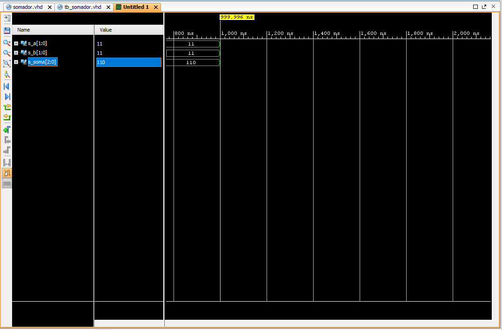

<div align="center">

# Projeto 1: Somador de 2 Bits

</div>

## 1. Somador de 2 Bits

Implementação de um circuito combinacional que soma dois números de 2 bits (`a` e `b`), gerando um resultado de 3 bits (`soma`) para acomodar o bit de carry.

#### Resultados da Simulação

*Figura 1: Simulação mostrando a varredura de todas as 16 combinações de entrada e o resultado da soma correspondente.*

#### Código Fonte

**Design (somador.vhd):**
```vhdl
library IEEE;
use IEEE.STD_LOGIC_1164.ALL;
use IEEE.NUMERIC_STD.ALL;

entity somador is
    Port ( 
        a    : in  STD_LOGIC_VECTOR(1 downto 0);
        b    : in  STD_LOGIC_VECTOR(1 downto 0);
        soma : out STD_LOGIC_VECTOR(2 downto 0)
    );
end somador;

architecture Behavioral of somador is
begin
    soma <= std_logic_vector(unsigned('0' & a) + unsigned('0' & b));
end Behavioral;
```
**TestBench (tb_somador.vhd):**
```vhdl
library IEEE;
use IEEE.STD_LOGIC_1164.ALL;
use IEEE.NUMERIC_STD.ALL;

entity tb_somador is
end tb_somador;

architecture Behavioral of tb_somador is

    component somador
        Port ( 
            a    : in  STD_LOGIC_VECTOR(1 downto 0);
            b    : in  STD_LOGIC_VECTOR(1 downto 0);
            soma : out STD_LOGIC_VECTOR(2 downto 0)
        );
    end component;

    signal s_a    : STD_LOGIC_VECTOR(1 downto 0) := "00";
    signal s_b    : STD_LOGIC_VECTOR(1 downto 0) := "00";
    signal s_soma : STD_LOGIC_VECTOR(2 downto 0);

begin

    uut: somador
        port map (
            a    => s_a,
            b    => s_b,
            soma => s_soma
        );

    stim_proc: process
    begin
        for i in 0 to 3 loop
            for j in 0 to 3 loop
                s_a <= std_logic_vector(to_unsigned(i, 2));
                s_b <= std_logic_vector(to_unsigned(j, 2));
                wait for 10 ns;
            end loop;
        end loop;
        wait;
    end process;

end Behavioral;
