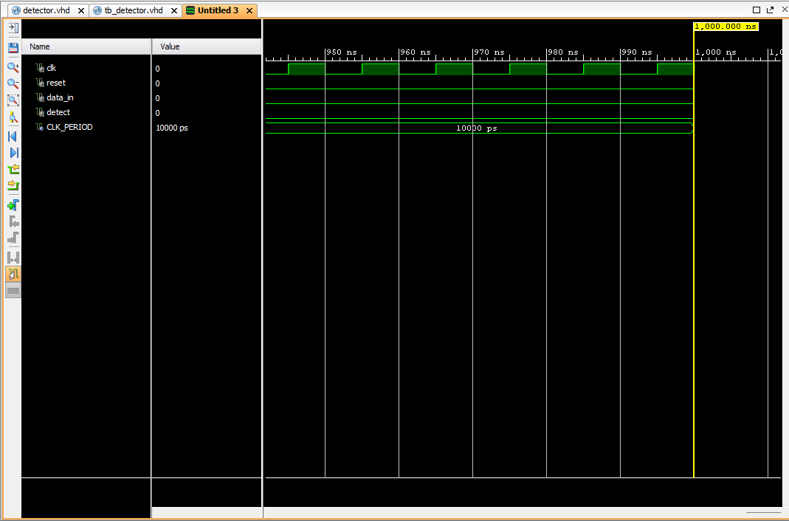

<div align="center">

# Projeto 2: Detector de Sequência "11010"

</div>

## 2. Detector de Sequência (FSM 5 bits)

Projeto de uma FSM do tipo Moore que detecta a sequência “11010” em um fluxo serial de bits.
- A saída ‘detect’ deve ser ativada em ‘1’ apenas no ciclo em que a sequência completa for reconhecida.
- Após a detecção, a FSM deve voltar ao estado inicial, aguardando novamente os 5 bits completos (sem sobreposição).

#### Diagrama de Estados (Texto Simples)
```
(S_IDLE) --'1'--> (S_1)
(S_IDLE) --'0'--> (S_IDLE)

(S_1) --'1'--> (S_11)
(S_1) --'0'--> (S_IDLE)

(S_11) --'0'--> (S_110)
(S_11) --'1'--> (S_11)

(S_110) --'1'--> (S_1101)
(S_110) --'0'--> (S_IDLE)

(S_1101) --'0'--> (S_DETECT) [Saída detect = '1']
(S_1101) --'1'--> (S_1)

(S_DETECT) --'qualquer'--> (S_IDLE)
```

#### Resultados da Simulação

*Figura 2: Simulação validando a detecção da sequência correta e o comportamento da FSM em casos de falha.*

#### Código Fonte

**Design (detector.vhd):**
```vhdl
library IEEE;
use IEEE.STD_LOGIC_1164.ALL;

entity detector is
    Port (
        clk      : in  STD_LOGIC;
        reset    : in  STD_LOGIC;
        data_in  : in  STD_LOGIC;
        detect   : out STD_LOGIC
    );
end detector;

architecture Behavioral of detector is

    type state_type is (S_IDLE, S_1, S_11, S_110, S_1101, S_DETECT);
    signal current_state, next_state : state_type;

begin

    process(clk, reset)
    begin
        if reset = '1' then
            current_state <= S_IDLE;
        elsif rising_edge(clk) then
            current_state <= next_state;
        end if;
    end process;

    process(current_state, data_in)
    begin
        if current_state = S_DETECT then
            detect <= '1';
        else
            detect <= '0';
        end if;

        case current_state is
            when S_IDLE =>
                if data_in = '1' then
                    next_state <= S_1;
                else
                    next_state <= S_IDLE;
                end if;
            when S_1 =>
                if data_in = '1' then
                    next_state <= S_11;
                else
                    next_state <= S_IDLE;
                end if;
            when S_11 =>
                if data_in = '0' then
                    next_state <= S_110;
                else
                    next_state <= S_11;
                end if;
            when S_110 =>
                if data_in = '1' then
                    next_state <= S_1101;
                else
                    next_state <= S_IDLE;
                end if;
            when S_1101 =>
                if data_in = '0' then
                    next_state <= S_DETECT;
                else
                    next_state <= S_1;
                end if;
            when S_DETECT =>
                next_state <= S_IDLE;
        end case;
    end process;

end Behavioral;
```

**TestBench (tb_detector.vhd):**
```vhld
library IEEE;
use IEEE.STD_LOGIC_1164.ALL;

entity tb_detector is
end tb_detector;

architecture Behavioral of tb_detector is

    component detector
        Port (
            clk      : in  STD_LOGIC;
            reset    : in  STD_LOGIC;
            data_in  : in  STD_LOGIC;
            detect   : out STD_LOGIC
        );
    end component;

    signal clk      : STD_LOGIC := '0';
    signal reset    : STD_LOGIC;
    signal data_in  : STD_LOGIC;
    signal detect   : STD_LOGIC;

    constant CLK_PERIOD : time := 10 ns;

begin

    uut: detector
        port map (
            clk      => clk,
            reset    => reset,
            data_in  => data_in,
            detect   => detect
        );

    clk_process : process
    begin
        clk <= '0';
        wait for CLK_PERIOD / 2;
        clk <= '1';
        wait for CLK_PERIOD / 2;
    end process;

    stimulus_process : process
    begin
        reset <= '1';
        data_in <= '0';
        wait for 2 * CLK_PERIOD;
        reset <= '0';
        wait for CLK_PERIOD;

        -- Teste com a sequência CORRETA "11010"
        data_in <= '1'; wait for CLK_PERIOD;
        data_in <= '1'; wait for CLK_PERIOD;
        data_in <= '0'; wait for CLK_PERIOD;
        data_in <= '1'; wait for CLK_PERIOD;
        data_in <= '0'; wait for CLK_PERIOD;
        wait for 2 * CLK_PERIOD;

        -- Teste com bits incorretos no meio
        data_in <= '1'; wait for CLK_PERIOD;
        data_in <= '1'; wait for CLK_PERIOD;
        data_in <= '0'; wait for CLK_PERIOD;
        data_in <= '0'; wait for CLK_PERIOD;
        wait for 2 * CLK_PERIOD;

        -- Teste com sequência correta após uma falha
        data_in <= '1'; wait for CLK_PERIOD; 
        data_in <= '0'; wait for CLK_PERIOD;
        data_in <= '1'; wait for CLK_PERIOD;
        data_in <= '1'; wait for CLK_PERIOD;
        data_in <= '0'; wait for CLK_PERIOD;
        data_in <= '1'; wait for CLK_PERIOD;
        data_in <= '0'; wait for CLK_PERIOD;
        wait for 2 * CLK_PERIOD;
        
        wait;

    end process;

end Behavioral;
```
