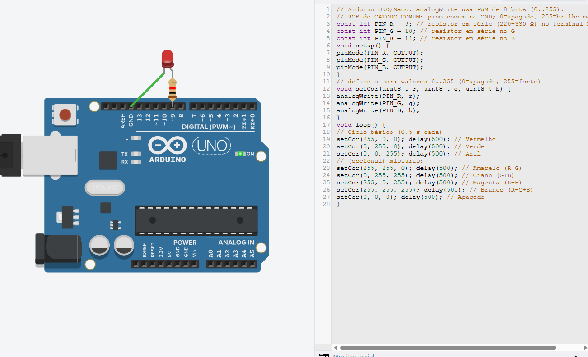

<div align="center">

# Meus Projetos com Arduino e PWM - Sistemas Digitais

</div>

Este repositório contém uma coleção de projetos básicos desenvolvidos em C++ para a plataforma Arduino, com foco no uso de Modulação por Largura de Pulso (PWM) para controlar a intensidade de LEDs. Cada projeto inclui uma imagem do circuito, uma breve descrição e o código-fonte completo.

## Projetos

1.  [PWM em 50% de Duty Cycle](#1-pwm-em-50-de-duty-cycle)
2.  [PWM com 5 Níveis de Intensidade](#2-pwm-com-5-níveis-de-intensidade)
3.  [Efeito de Respiração com LED](#3-efeito-de-respiração-com-led)
4.  [Controle de LED RGB](#4-controle-de-led-rgb)

---

## 1. PWM em 50% de Duty Cycle

Este projeto demonstra o uso básico da função `analogWrite`. O LED é configurado para acender com aproximadamente 50% de sua intensidade máxima de forma constante.

#### Circuito e Simulação

*Figura 1: Circuito com um LED conectado ao pino 9 do Arduino, operando com 50% de duty cycle.*

#### Código Fonte
<details>
<summary>Clique para ver o código (ex_01.ino)</summary>

```cpp
// Arduino UNO/Nano/MEGA: analogWrite usa PWM de 8 bits (0..255).
// 0 = 0% (sempre desligado), 255 = 100% (sempre ligado).
// Ex.: 128 ≈ 50% de duty.
const int PIN_PWM = 9; // pino com PWM (Uno: 3,5,6,9,10,11)

void setup() {
  pinMode(PIN_PWM, OUTPUT);
  // Define o valor do PWM para 128, que corresponde a ~50%
  // Vmedia ≈ 0,5 * Vcc (≈2,5 V em 5 V)
  analogWrite(PIN_PWM, 128);
}

void loop() {
  // O código no setup já define o brilho,
  // então o loop pode ficar vazio para manter o LED aceso constantemente.
}
```
