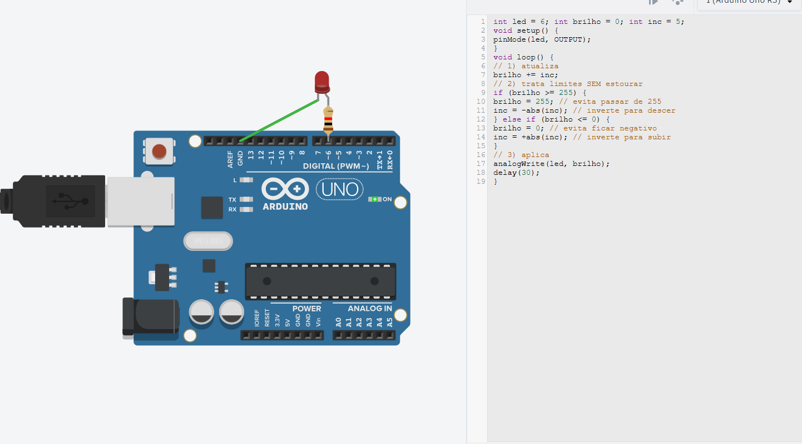

<div align="center">

# Meus Projetos com Arduino e PWM - Sistemas Digitais

</div>

Este repositório contém uma coleção de projetos básicos desenvolvidos em C++ para a plataforma Arduino, com foco no uso de Modulação por Largura de Pulso (PWM) para controlar a intensidade de LEDs. Cada projeto inclui uma imagem do circuito, uma breve descrição e o código-fonte completo.

## Projetos

1.  [PWM em 50% de Duty Cycle](#1-pwm-em-50-de-duty-cycle)
2.  [PWM com 5 Níveis de Intensidade](#2-pwm-com-5-níveis-de-intensidade)
3.  [Efeito de Respiração com LED](#3-efeito-de-respiração-com-led)
4.  [Controle de LED RGB](#4-controle-de-led-rgb)

---

## 1. PWM em 50% de Duty Cycle

Este projeto demonstra o uso básico da função `analogWrite`. O LED é configurado para acender com aproximadamente 50% de sua intensidade máxima de forma constante.

#### Circuito e Simulação

*Figura 1: Circuito com um LED conectado ao pino 9 do Arduino, operando com 50% de duty cycle.*

#### Código Fonte
<details>
<summary>Clique para ver o código (ex_01.ino)</summary>

```cpp
// Arduino UNO/Nano/MEGA: analogWrite usa PWM de 8 bits (0..255).
// 0 = 0% (sempre desligado), 255 = 100% (sempre ligado).
// Ex.: 128 ≈ 50% de duty.
const int PIN_PWM = 9; // pino com PWM (Uno: 3,5,6,9,10,11)

void setup() {
  pinMode(PIN_PWM, OUTPUT);
  // Define o valor do PWM para 128, que corresponde a ~50%
  // Vmedia ≈ 0,5 * Vcc (≈2,5 V em 5 V)
  analogWrite(PIN_PWM, 128);
}

void loop() {
  // O código no setup já define o brilho,
  // então o loop pode ficar vazio para manter o LED aceso constantemente.
}
```

## 2. PWM com 5 Níveis de Intensidade

Este projeto expande o conceito de PWM, fazendo o LED passar por cinco níveis de brilho pré-definidos (0%, 25%, 50%, 75% e 100%), permanecendo em cada nível por 1 segundo.

#### Circuito e Simulação

*Figura 2: O mesmo circuito da Figura 1, mas com um código que varia a intensidade do LED em 5 etapas.*

#### Código Fonte
<details>
<summary>Clique para ver o código (ex_02.ino)</summary>

```cpp
// Arduino: analogWrite = PWM 8 bits (0..255).
// 0%→0, 25%→64, 50%→128, 75%→192, 100%→255.
const int PIN_PWM = 9;
const int steps[] = {0, 64, 128, 192, 255}; // Array com os valores de PWM

void setup() {
  pinMode(PIN_PWM, OUTPUT);
}

void loop() {
  // Percorre o array de 'steps'
  for (int i = 0; i < 5; i++) {
    analogWrite(PIN_PWM, steps[i]);
    delay(1000); // Espera 1 segundo em cada nível de brilho
  }
}
```

## 3. Efeito de Respiração com LED

Este projeto cria um efeito visual de "respiração" (fade in e fade out), onde a intensidade do LED aumenta e diminui suavemente de forma contínua.

#### Circuito e Simulação

*Figura 3: LED conectado ao pino 6, programado para aumentar e diminuir o brilho gradualmente.*

#### Código Fonte
<details>
<summary>Clique para ver o código (ex_03.ino)</summary>

```cpp
int led = 6;
int brilho = 0;
int inc = 5; // Valor do incremento a cada passo

void setup() {
  pinMode(led, OUTPUT);
}

void loop() {
  // 1) Atualiza o valor do brilho
  brilho = brilho + inc;

  // 2) Trata os limites para inverter a direção.
  // Se o brilho atingir o máximo (255) ou o mínimo (0),
  // inverte o sinal do incremento para começar a descer/subir.
  if (brilho <= 0 || brilho >= 255) {
    inc = -inc;
  }

  // 3) Aplica o valor do brilho ao LED
  analogWrite(led, brilho);

  // Pequena pausa para que o efeito seja suave e visível
  delay(30);
}
```

## 4. Controle de LED RGB

Este projeto controla um LED RGB (Cátodo Comum) para exibir um ciclo de cores, incluindo as primárias (Vermelho, Verde, Azul) e suas misturas (Amarelo, Ciano, Magenta e Branco).

#### Circuito e Simulação

*Figura 4: LED RGB conectado aos pinos 9, 10 e 11, cada um controlando um canal de cor (R, G, B).*

#### Código Fonte
<details>
<summary>Clique para ver o código (ex_04.ino)</summary>

```cpp
// Arduino UNO/Nano: analogWrite usa PWM de 8 bits (0..255).
// RGB de CÁTODO COMUM: pino comum no GND; 0=apagado, 255=brilho máximo.
const int PIN_R = 9;  // Resistor em série (220–330 Ω) no terminal R
const int PIN_G = 10; // Resistor em série no terminal G
const int PIN_B = 11; // Resistor em série no terminal B

void setup() {
  pinMode(PIN_R, OUTPUT);
  pinMode(PIN_G, OUTPUT);
  pinMode(PIN_B, OUTPUT);
}

// Função auxiliar para definir a cor
// Recebe os valores de 0 a 255 para cada cor
void setCor(uint8_t r, uint8_t g, uint8_t b) {
  analogWrite(PIN_R, r);
  analogWrite(PIN_G, g);
  analogWrite(PIN_B, b);
}

void loop() {
  // Ciclo básico (0,5 s cada cor)
  setCor(255, 0, 0);   delay(500); // Vermelho
  setCor(0, 255, 0);   delay(500); // Verde
  setCor(0, 0, 255);   delay(500); // Azul

  // (Opcional) Misturas de cores
  setCor(255, 255, 0);   delay(500); // Amarelo (R+G)
  setCor(0, 255, 255);   delay(500); // Ciano (G+B)
  setCor(255, 0, 255);   delay(500); // Magenta (R+B)
  setCor(255, 255, 255); delay(500); // Branco (R+G+B)
  setCor(0, 0, 0);       delay(500); // Apagado
}

```
