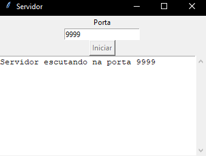
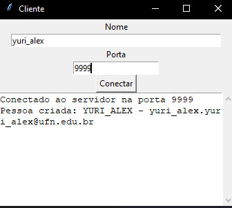
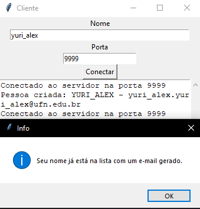
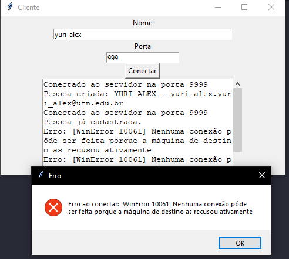

# Sistema Cliente-Servidor de Cadastro

Este projeto é uma simples aplicação cliente-servidor desenvolvida em Python com uma interface gráfica usando a biblioteca Tkinter.

A aplicação permite que múltiplos clientes se conectem a um servidor para se cadastrarem. Ao receber o nome completo de um cliente, o servidor gera um e-mail institucional fictício, armazena o nome em uma lista de clientes conectados e devolve os dados para o cliente. O servidor impede o cadastro de nomes duplicados.

## Funcionalidades

* **Servidor:**
    * Inicia a escuta em uma porta TCP especificada.
    * Aceita múltiplas conexões de clientes simultaneamente usando threads.
    * Recebe um nome do cliente, o converte para maiúsculas e gera um e-mail no formato `primeironome.ultimonome@ufn.edu.br`.
    * Mantém uma lista de clientes conectados e a exibe em sua interface.
    * Registra logs de conexões.
* **Cliente:**
    * Permite que o usuário insira seu nome completo e a porta do servidor.
    * Envia o nome para o servidor.
    * Recebe e exibe os dados da pessoa (nome e e-mail gerado) ou uma mensagem de erro se o nome já estiver cadastrado.
    * Registra logs da comunicação.

## Pré-requisitos

Antes de começar, garanta que você tenha os seguintes softwares instalados:

* **Python 3.x:** A aplicação foi desenvolvida em Python e utiliza bibliotecas padrão.
* **Visual Studio Code (Recomendado):** Um editor de código com um terminal integrado que facilita a execução do servidor e do cliente ao mesmo tempo.
* **Extensão Python para VS Code:** Se for usar o VS Code, instale a extensão oficial da Microsoft para Python.

## Como Rodar a Aplicação

Siga os passos abaixo para executar o projeto.

1.  **Estrutura dos Arquivos:** Certifique-se de que todos os arquivos (`servidor.py`, `cliente.py`, `pessoa.py`) estejam na mesma pasta.
2.  **Inicie o Servidor:** Abra um terminal, navegue até a pasta do projeto e execute `python servidor.py`. Na interface, digite uma porta (ex: `9999`) e clique em "Iniciar".
3.  **Inicie o Cliente:** Abra um **novo** terminal e execute `python cliente.py`. Na interface, digite seu nome e a **mesma porta** do servidor, e clique em "Conectar".

## Demonstração

Abaixo estão as telas que ilustram o funcionamento da aplicação.

### 1. Servidor Iniciado

  
   
  <em>Após executar o script e clicar em "Iniciar", o servidor fica ativo e aguardando conexões.</em>

### 2. Conexão do Cliente Bem-sucedida

  
   
  <em>O e-mail é gerado e as informações são exibidas no log do cliente.</em>

### 3. Tentativa de Conexão com Nome Duplicado

  
   
  <em>Um aviso é exibido se o cliente tentar se conectar com um nome que já existe no servidor.</em>

### 4. Erro de Conexão

  
   
  <em>Um erro é exibido se o cliente tentar se conectar a uma porta incorreta ou se o servidor não estiver em execução.</em>

